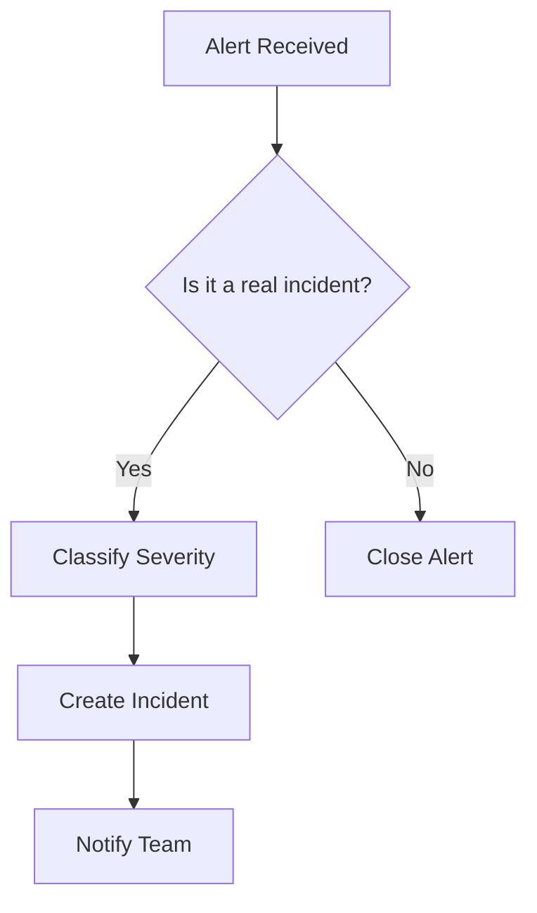

# TruePulse Incident Response Runbook

This document provides procedures for responding to incidents affecting the TruePulse platform.

## Table of Contents

1. [Incident Classification](#incident-classification)
2. [Response Team Contacts](#response-team-contacts)
3. [Incident Response Process](#incident-response-process)
4. [Common Incident Playbooks](#common-incident-playbooks)
5. [Post-Incident Process](#post-incident-process)
6. [Communication Templates](#communication-templates)

---

## Incident Classification

### Severity Levels

| Severity | Description | Response Time | Examples |
|----------|-------------|---------------|----------|
| **P1 - Critical** | Complete service outage affecting all users | 15 minutes | Production down, data breach, security incident |
| **P2 - High** | Major feature unavailable, significant user impact | 1 hour | Voting not working, authentication failures |
| **P3 - Medium** | Degraded service, limited user impact | 4 hours | Slow response times, minor feature issues |
| **P4 - Low** | Minor issues, no immediate user impact | 24 hours | Cosmetic bugs, minor performance issues |

### Impact Assessment Matrix

```
Impact = Severity × Number of Affected Users × Business Criticality

Business Criticality:
- Core voting functionality: Critical
- User authentication: Critical
- Poll display: High
- Gamification/achievements: Medium
- Analytics/reporting: Low
```

---

## Response Team Contacts

### Primary Contacts

| Role | Name | Contact | Escalation |
|------|------|---------|------------|
| Incident Commander | [TBD] | [email/phone] | Primary |
| Backend Lead | [TBD] | [email/phone] | Technical |
| Frontend Lead | [TBD] | [email/phone] | Technical |
| DevOps/Infrastructure | [TBD] | [email/phone] | Infrastructure |
| Security Lead | [TBD] | [email/phone] | Security incidents |

### Escalation Path

```
1. On-call engineer (0-15 min)
   ↓
2. Team lead (15-30 min)
   ↓
3. Engineering manager (30-60 min)
   ↓
4. CTO/Executive (60+ min for P1)
```

### External Contacts

| Service | Support Contact | Account ID |
|---------|-----------------|------------|
| Azure Support | Azure Portal → Support | [Subscription ID] |
| Cloudflare (CDN/WAF) | support@cloudflare.com | [Account ID] |
| SendGrid (if used) | support@sendgrid.com | [Account ID] |

---

## Incident Response Process

### 1. Detection and Triage (0-15 minutes)



**Steps:**
1. Acknowledge the alert in Azure Monitor/PagerDuty
2. Verify the issue is real (not false positive)
3. Classify severity using the matrix above
4. Create incident ticket with:
   - Title: `[P{N}] Brief description`
   - Description: What, when, who affected
   - Time detected
   - Initial impact assessment

### 2. Containment (15-60 minutes)

**Objectives:**
- Stop the bleeding
- Prevent further damage
- Preserve evidence

**Actions:**
- [ ] Assess current impact scope
- [ ] Implement temporary mitigations
- [ ] Enable additional logging if needed
- [ ] For security incidents: preserve logs, isolate affected systems

### 3. Resolution (Variable)

**Steps:**
1. Identify root cause
2. Implement fix (follow deployment process)
3. Test fix in staging if time permits
4. Deploy to production
5. Monitor for improvement

### 4. Recovery (Post-fix)

**Steps:**
1. Verify service restoration
2. Monitor key metrics for 30 minutes
3. Gradually restore any disabled features
4. Update status page
5. Notify stakeholders

---

## Common Incident Playbooks

### Playbook: Production API Down

**Symptoms:**
- HTTP 500 errors from API
- Health checks failing
- No backend logs

**Investigation Steps:**

```bash
# 1. Check Container App status
az containerapp show \
  --name truepulse-api-{env} \
  --resource-group rg-truepulse-{env} \
  --query "properties.runningStatus"

# 2. View recent logs
az containerapp logs show \
  --name truepulse-api-{env} \
  --resource-group rg-truepulse-{env} \
  --tail 100

# 3. Check recent deployments
az containerapp revision list \
  --name truepulse-api-{env} \
  --resource-group rg-truepulse-{env}
```

**Resolution:**
1. If recent deployment caused issue → rollback revision
2. If resource exhaustion → scale up replicas
3. If database issue → check Cosmos DB status

**Rollback Command:**
```bash
az containerapp revision activate \
  --name truepulse-api-{env} \
  --resource-group rg-truepulse-{env} \
  --revision {previous-revision-name}
```

---

### Playbook: Database Connectivity Issues

**Symptoms:**
- Connection timeout errors
- Request throttling (429 errors)
- Slow query performance

**Investigation Steps:**

```bash
# 1. Check Cosmos DB account status
az cosmosdb show \
  --name cosmos-truepulse-{env} \
  --resource-group rg-truepulse-{env}

# 2. Check Cosmos DB metrics in Azure Portal
# - Request Units consumed vs provisioned
# - Number of throttled requests
# - Latency metrics

# 3. Check application logs for database errors
az containerapp logs show \
  --name truepulse-api-{env} \
  --resource-group rg-truepulse-{env} \
  --tail 100 | grep -i cosmos
```

**Resolution:**
1. Kill long-running queries if identified
2. Increase max_connections if needed
3. Check for connection leaks in application code
4. Scale up database tier if resource constrained

---

### Playbook: High Response Times

**Symptoms:**
- P95 latency > 2 seconds
- Users reporting slow page loads
- API timeout errors

**Investigation Steps:**

```bash
# 1. Check Application Insights for slow requests
# In Azure Portal: Application Insights → Performance

# 2. Check database query performance
# In Application Insights → Application Map → Dependencies

# 3. Check Container App metrics
az monitor metrics list \
  --resource /subscriptions/{sub}/resourceGroups/{rg}/providers/Microsoft.App/containerApps/truepulse-api-{env} \
  --metric "Requests" "RequestDuration" \
  --interval PT1M
```

**Resolution:**
1. Identify slow endpoints/queries
2. Add database indexes if needed
3. Scale up container app replicas
4. Enable response caching if appropriate

---

### Playbook: Security Incident (Suspected Breach)

**Symptoms:**
- Unusual access patterns
- Failed authentication spikes
- Data exfiltration alerts

**IMMEDIATE ACTIONS:**

```bash
# 1. DO NOT delete any logs or evidence

# 2. Rotate all secrets immediately
# In GitHub: Settings → Secrets and variables → Actions
# Update: JWT_SECRET_KEY, VOTE_HASH_SECRET, FIELD_ENCRYPTION_KEY

# 3. Revoke compromised tokens
# Invalidate all active sessions by changing JWT_SECRET_KEY

# 4. Enable enhanced logging
az monitor diagnostic-settings create \
  --name security-incident-logging \
  --resource {resource-id} \
  --logs '[{"category": "AllLogs", "enabled": true}]'
```

**Investigation:**
1. Review Azure Activity Logs
2. Check Application Insights for suspicious requests
3. Review database access logs
4. Check for unauthorized data access

**Communication:**
- Notify security lead immediately
- Document timeline of events
- Prepare breach notification if required (GDPR, etc.)

---

### Playbook: Voting System Integrity Issues

**Symptoms:**
- Duplicate votes detected
- Vote counts don't match expectations
- Fraud detection alerts

**Investigation Steps:**

```sql
-- Check for duplicate votes
SELECT voter_fingerprint, poll_id, count(*) 
FROM user_vote_history 
GROUP BY voter_fingerprint, poll_id 
HAVING count(*) > 1;

-- Check vote counts vs history
SELECT p.id, p.title, 
       (SELECT count(*) FROM user_vote_history WHERE poll_id = p.id) as history_count,
       (SELECT sum(vote_count) FROM vote WHERE poll_id = p.id) as vote_total
FROM poll p;

-- Review fraud detection logs
SELECT * FROM user_vote_history 
WHERE fraud_score > 0.7 
ORDER BY voted_at DESC;
```

**Resolution:**
1. If bot attack → enable stricter rate limiting
2. If duplicate votes → run deduplication script
3. If data corruption → restore from backup (see Backup Recovery)

---

### Playbook: Frontend/Static Web App Issues

**Symptoms:**
- 404 errors on frontend routes
- Assets not loading
- Stale content being served

**Investigation Steps:**

```bash
# 1. Check SWA deployment status
az staticwebapp show \
  --name truepulse-frontend-{env} \
  --resource-group rg-truepulse-{env}

# 2. Check recent deployments
az staticwebapp environment list \
  --name truepulse-frontend-{env}

# 3. Purge CDN cache if using custom domain
az cdn endpoint purge \
  --content-paths "/*" \
  --name {endpoint-name} \
  --profile-name {profile-name} \
  --resource-group {rg}
```

**Resolution:**
1. Trigger manual deployment if build failed
2. Check staticwebapp.config.json for routing issues
3. Verify API proxy configuration

---

## Backup and Recovery

### Database Backup

Azure Cosmos DB provides automatic continuous backups with point-in-time restore.

**Restore from Point-in-Time:**
```bash
# Restore to a new account from a specific point in time
az cosmosdb restorable-database-account list \
  --account-name cosmos-truepulse-{env}

# Trigger restore (requires support ticket for serverless)
# For provisioned throughput accounts:
az cosmosdb restore \
  --resource-group rg-truepulse-{env} \
  --target-database-account-name cosmos-truepulse-{env}-restored \
  --account-name cosmos-truepulse-{env} \
  --restore-timestamp "2024-01-15T10:30:00Z" \
  --location eastus
```

**Check Backup Status:**
```bash
# List restorable resources
az cosmosdb restorable-database-account list \
  --account-name cosmos-truepulse-{env}
```

### Application Rollback

**Container App Revision Rollback:**
```bash
# List revisions
az containerapp revision list \
  --name truepulse-api-{env} \
  --resource-group rg-truepulse-{env} \
  --output table

# Activate previous revision
az containerapp revision activate \
  --name truepulse-api-{env} \
  --resource-group rg-truepulse-{env} \
  --revision {revision-name}

# Route traffic to previous revision
az containerapp ingress traffic set \
  --name truepulse-api-{env} \
  --resource-group rg-truepulse-{env} \
  --revision-weight {revision-name}=100
```

---

## Post-Incident Process

### Incident Timeline Template

```markdown
## Incident Timeline: [Incident Title]

**Incident ID:** INC-YYYY-MM-DD-001
**Severity:** P{N}
**Duration:** HH:MM
**Affected Users:** ~N users

### Timeline (UTC)
| Time | Event |
|------|-------|
| HH:MM | Alert triggered |
| HH:MM | Incident acknowledged |
| HH:MM | Root cause identified |
| HH:MM | Fix deployed |
| HH:MM | Service restored |

### Root Cause
[Description of what caused the incident]

### Impact
[Description of user/business impact]

### Resolution
[Description of how it was fixed]

### Action Items
- [ ] Action 1 - Owner - Due date
- [ ] Action 2 - Owner - Due date
```

### Blameless Post-Mortem Process

1. **Schedule post-mortem** within 48 hours of incident resolution
2. **Participants:** All involved in incident response
3. **Focus on systems**, not individuals
4. **Document:**
   - What happened
   - Why it happened (5 Whys)
   - How we detected it
   - How we fixed it
   - What we'll do to prevent recurrence

---

## Communication Templates

### Internal Incident Notification

```
Subject: [P{N}] TruePulse - {Brief Description}

Team,

We are currently experiencing issues with {affected system/feature}.

**Status:** Investigating / Identified / Fixing / Resolved
**Impact:** {Description of user impact}
**Started:** {Time UTC}
**Current Actions:** {What we're doing}

Updates will be posted every {15/30/60} minutes.

{Name}
Incident Commander
```

### User-Facing Status Update

```
**Investigating issues with {feature}**

We are currently investigating issues affecting {brief description}.

Some users may experience {symptom}. Our team is actively working to resolve this.

We apologize for any inconvenience and will provide updates as we learn more.

Last updated: {Time UTC}
```

### Resolution Notification

```
**Resolved: {Brief Description}**

The issue affecting {feature} has been resolved.

**Duration:** {start time} to {end time} ({duration})
**Impact:** {what users experienced}
**Resolution:** {brief description of fix}

We apologize for any inconvenience this may have caused.

If you continue to experience issues, please contact support.
```

---

## Monitoring and Alerts Reference

### Key Metrics to Watch

| Metric | Normal | Warning | Critical |
|--------|--------|---------|----------|
| API Response Time (P95) | < 500ms | 500ms-2s | > 2s |
| Error Rate | < 1% | 1-5% | > 5% |
| Database Connections | < 80% | 80-90% | > 90% |
| Container CPU | < 70% | 70-85% | > 85% |
| Container Memory | < 75% | 75-90% | > 90% |

### Alert Query Examples (Azure Monitor)

**High Error Rate:**
```kusto
requests
| where timestamp > ago(5m)
| summarize 
    total = count(),
    errors = countif(success == false)
| extend error_rate = errors * 100.0 / total
| where error_rate > 5
```

**Slow Responses:**
```kusto
requests
| where timestamp > ago(5m)
| summarize percentile(duration, 95) by bin(timestamp, 1m)
| where percentile_duration_95 > 2000
```

---

## Appendix: Quick Reference Commands

### Azure CLI Login
```bash
az login
az account set --subscription "TruePulse-{env}"
```

### View All Resources
```bash
az resource list --resource-group rg-truepulse-{env} --output table
```

### Check Service Health
```bash
# API Health
curl https://api-{env}.truepulse.io/health

# Cosmos DB
az cosmosdb show --name cosmos-truepulse-{env} --resource-group rg-truepulse-{env} --query "provisioningState"

# Container App
az containerapp show --name truepulse-api-{env} --resource-group rg-truepulse-{env} --query "properties.runningStatus"
```

---

**Document Version:** 1.0  
**Last Updated:** January 2025  
**Next Review:** April 2025
